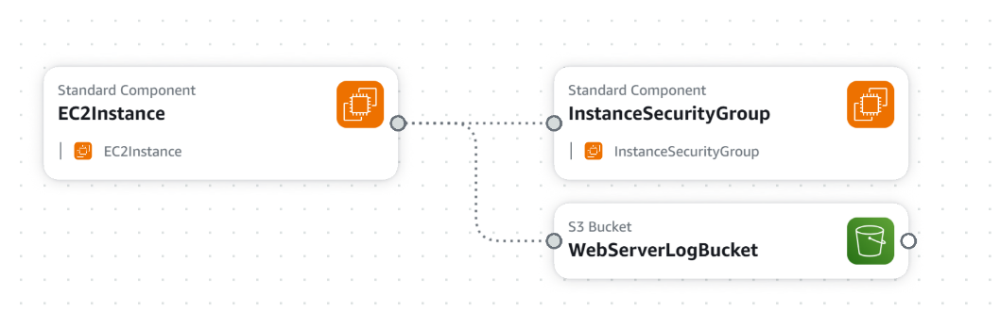
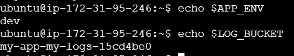

# EC2 Instance with S3 Log Bucket

## 📌 Overview
This CloudFormation template creates:
- **An EC2 instance** running Amazon Linux 2.
- **An S3 bucket** for storing logs.
- **Security group** allowing SSH access.
- **User data script** that sets up system environment variables:
  - `LOG_BUCKET` (the name of the S3 bucket)
  - `APP_ENV` (deployment environment)

## 🚀 Deployment Instructions
Follow the steps in the [main repository README](../README.md) to deploy this stack.

### 🔹 Parameters
| Parameter          | Description                                   | Default    |
|-------------------|----------------------------------|------------|
| `AppEnv`         | Deployment environment (`dev`, `staging`, `production`) | `dev` |
| `InstanceType`   | EC2 instance type (`t2.micro`, `m1.small`, etc.) | `t2.micro` |
| `KeyName`        | SSH key pair name | *(required)* |
| `ImageId`        | AMI ID | `ami-0f9de6e2d2f067fca` |
| `LogBucketNamePrefix` | Prefix for S3 bucket | `App` |

### 📤 Outputs
| Output        | Description |
|--------------|-------------|
| `InstanceId` | The ID of the EC2 instance |
| `PublicIp`   | The public IP of the EC2 instance |
| `LogBucketName` | Name of the S3 log bucket |

## 📂 Project Structure  

## 🔥 EC2 Instance

